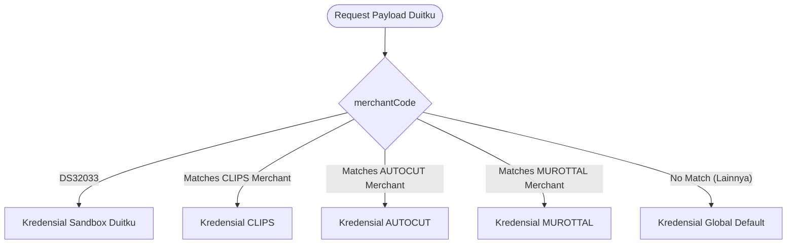

# Spesifikasi Kebutuhan Sistem (SRS): Integrasi Multi-Merchant Duitku

Dokumen ini mendefinisikan arsitektur dan spesifikasi teknis untuk mendukung transaksi dari beberapa akun merchant Duitku (ID Merchant & API Key) yang berbeda secara bersamaan untuk aplikasi `CLIPS`, `AUTOCUT`, dan `MUROTTAL` pada backend Intisari.

---

## 1. Latar Belakang & Kebutuhan Bisnis

Untuk fleksibilitas bisnis dan kemungkinan pemisahan aliran keuangan/rekening penampung antar produk, backend harus mampu menangani notifikasi pembayaran (webhook) dari berbagai akun Duitku produksi yang berbeda. 

Sistem harus memvalidasi keaslian transaksi (signature checking) menggunakan API Key produksi yang tepat dari akun yang memicu transaksi tersebut.

---

## 2. Arsitektur Pemetaan Kredensial

Sistem mengadopsi mekanisme **Dynamic Mapping dengan Fallback**:

1.  **Dinamis**: `merchantCode` yang dikirim dalam request payload dicocokkan dengan variabel environment merchant code kustom yang didaftarkan untuk masing-masing aplikasi (`CLIPS`, `AUTOCUT`, `MUROTTAL`).
2.  **Fallback**: Jika `merchantCode` produksi yang masuk tidak terdaftar di konfigurasi kustom per-aplikasi, sistem akan jatuh ke kredensial global default (`env.DUITKU_MERCHANT_CODE` dan `env.DUITKU_API_KEY`). Ini memastikan fungsionalitas backward-compatibility terjaga sempurna.
3.  **Sandbox**: Jika `merchantCode` bernilai `"DS32033"`, sistem secara otomatis mengabaikan konfigurasi produksi dan menggunakan API Key sandbox Duitku bawaan (`83afbae747ea45b155427183097d9492`).

---

## 3. Spesifikasi Variabel Lingkungan (Environment Variables)

Variabel-variabel berikut dapat dikonfigurasi pada Cloudflare Workers Secret:

| Variabel Lingkungan | Deskripsi | Sifat |
|---|---|---|
| `DUITKU_MERCHANT_CODE` | Merchant Code default / global | Opsional (Default/Fallback) |
| `DUITKU_API_KEY` | API Key default / global | Opsional (Default/Fallback) |
| `DUITKU_MERCHANT_CLIPS` | Merchant Code khusus untuk aplikasi CLIPS | Opsional (Kustom) |
| `DUITKU_API_KEY_CLIPS` | API Key khusus untuk aplikasi CLIPS | Opsional (Kustom) |
| `DUITKU_MERCHANT_AUTOCUT` | Merchant Code khusus untuk aplikasi AUTOCUT | Opsional (Kustom) |
| `DUITKU_API_KEY_AUTOCUT` | API Key khusus untuk aplikasi AUTOCUT | Opsional (Kustom) |
| `DUITKU_MERCHANT_MUROTTAL` | Merchant Code khusus untuk aplikasi MUROTTAL | Opsional (Kustom) |
| `DUITKU_API_KEY_MUROTTAL` | API Key khusus untuk aplikasi MUROTTAL | Opsional (Kustom) |

---

## 4. Validasi Keamanan (Signature Checking)

Backend memverifikasi request callback dari Duitku menggunakan formula hash MD5 berikut:

$$\text{Signature} = \text{MD5}(\text{merchantCode} + \text{amount} + \text{merchantOrderId} + \text{API Key})$$

Di mana `API Key` adalah kunci yang dipilih berdasarkan hasil pemetaan pada Seksi 2. Jika signature yang dihitung ulang oleh backend tidak sama dengan parameter `signature` dari payload (case-insensitive), request ditolak dengan HTTP status `401 Unauthorized`.
